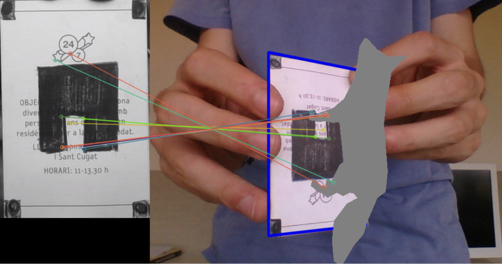
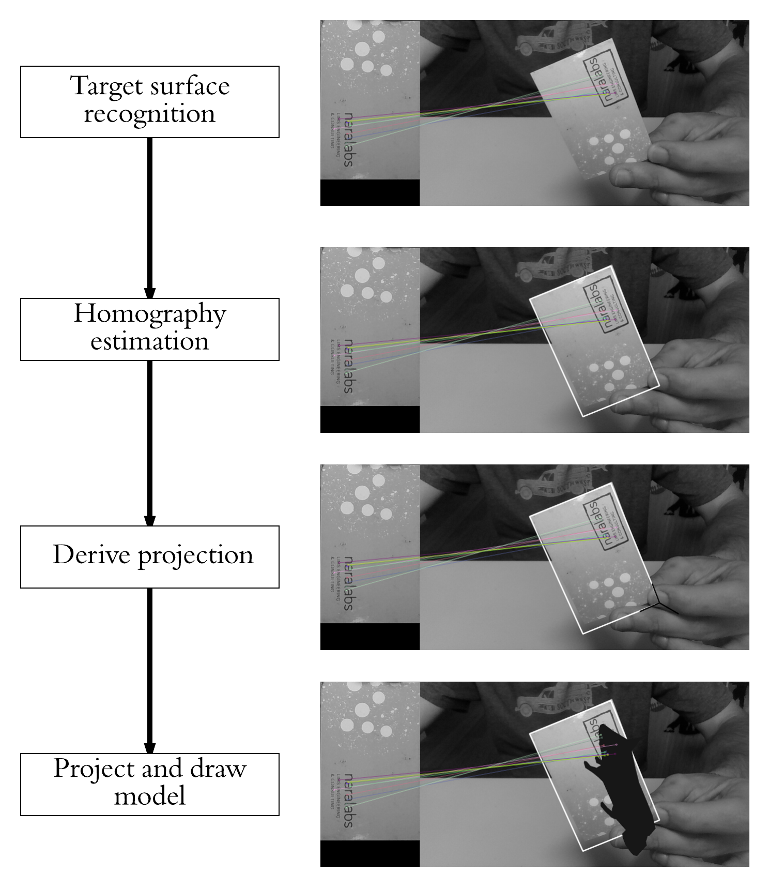
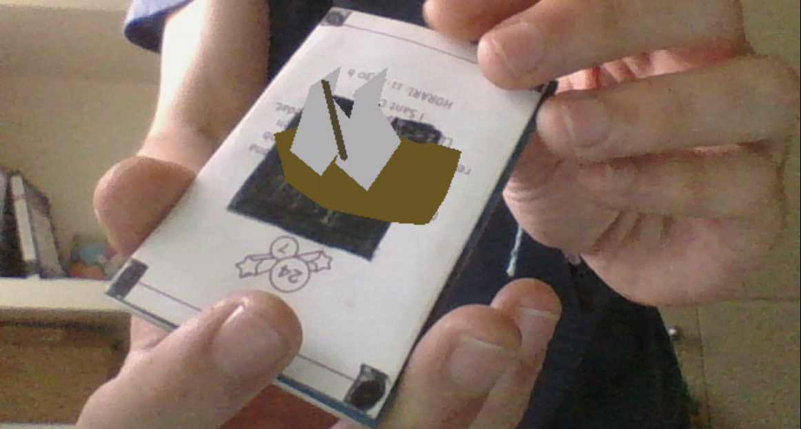

</img>
# Python AR Application with OpenCV and numpy

This application is an Augmented Reality (AR) application built using Python, numpy, and OpenCV. It enables rendering 3D models on top of a reference surface detected in the video feed.

## Features

- Real-time rendering of 3D models on top of a reference surface
- Support for different 3D models in .obj format
- Command-line arguments for visualization options

## Overall Workflow

</img>

Additionally you can also refer to my notes for further clarity regarding the project.

## Installation

1. Clone the repository:

```bash
git clone https://github.com/BRArjun/Python_ARVR.git
```

2. Install required dependencies:
```bash
pip install numpy opencv-python
```

## Usage

* Place the image of the surface to be tracked inside the `reference` folder.
* On line 37 of `src/ar_main.py` replace `'model.jpg'` with the name of the image you just copied inside the `reference` folder.
* On line 41 of `src/ar_main.py` replace `'fox.obj'` with the name of the model you want to render.
* To change the size of the rendered model change the scale parameter (number `3`) in line 103 of `src/ar_main.py` by a suitable number. This might require some trial and error.
* Open a terminal session inside the project folder and run `python3 src/ar_main.py`

### Command line arguments

* `--rectangle`, `-r`: Draws the projection of the reference surface on the video frame as a blue rectangle.
* `--matches`, `-m`: Draws matches between reference surface and video frame.

## Troubleshooting

**If you get the message**:

```
Unable to capture video
```
printed on your terminal, the most likely cause is that your OpenCV installation has been compiled without FFMPEG support.
Especially for Linux users, make sure that your OpenCV installation has been compiled with FFMPEG support. Otherwise, capturing video will fail. Pre-built OpenCV packages such as the ones downloaded via pip are not compiled with FFMPEG support, which means that you will have to build it manually.

## Results
</img>
